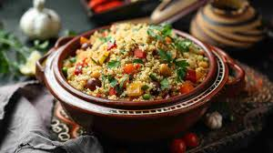
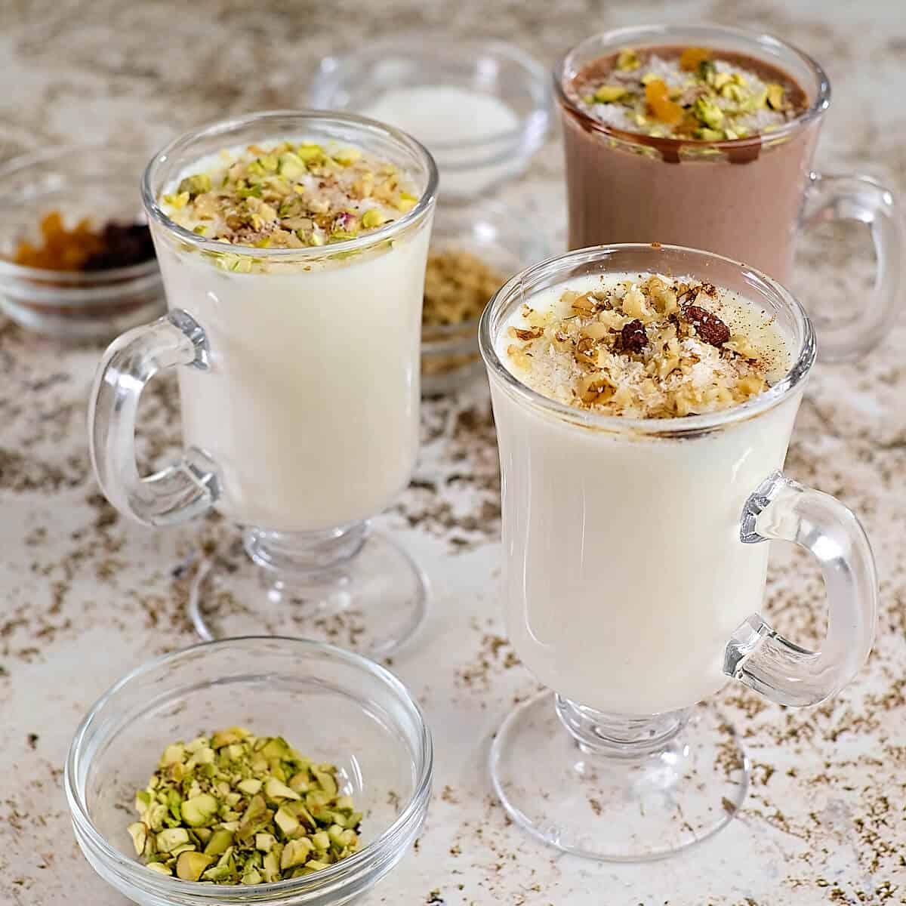
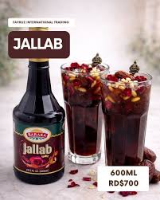
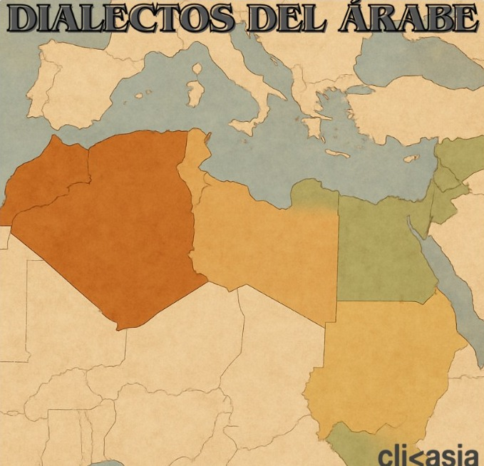
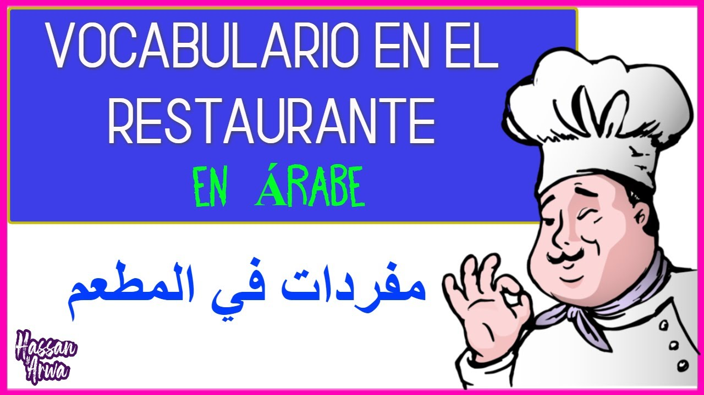
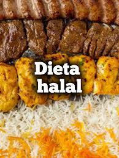
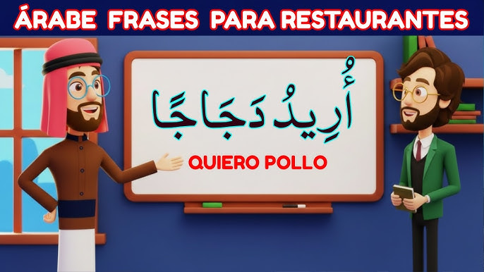

# En el restaurante — comida y bebida (A2)
*Aprende el vocabulario, platos, bebidas y expresiones esenciales para desenvolverte en un restaurante árabe. Ideal para nivel A2, con ejemplos prácticos y diálogos cotidianos.*
## Platos típicos árabes
En esta sección exploraremos algunos de los platillos más icónicos de la gastronomía árabe. Descubrirás los ingredientes clave y el proceso de preparación.
1. Hummus (حمص)
Una crema de garbanzos mezclada con tahini, ajo, limón y aceite de oliva. Es un aperitivo básico en la cocina árabe, muy saludable y fácil de preparar.
2. Falafel (فلافل)
Bolas fritas hechas de garbanzos molidos o habas, mezcladas con hierbas y especias. Es un plato popular para vegetarianos y veganos.
3. Tabulé (تبولة)
Una ensalada refrescante hecha con perejil, tomate, cebolla, bulgur, menta y limón. Ideal para acompañar otros platos.
4. Kabsa (كبسة)
Un plato de arroz con especias, carne (generalmente cordero o pollo) y frutos secos, muy popular en Arabia Saudita y la región del Golfo.
5. Shawarma (شاورما)
Carne marinada y asada en un asador vertical, servida en pan pita con vegetales y salsas.
6. Cuscús (كسكس)
Se elabora con sémola de trigo y su resultado son pequeños granos similares al arroz que se utilizan en diversas recetas. Son excelentes para hacer ensaladas, pero también como ingrediente en rellenos, como en berenjenas. De hecho, el cuscús puede incorporarse en sopas o cremas para añadir textura y sabor.

## Bebidas típicas calientes árabes
En este espacio, conoceremos las bebidas calientes típicas, tales como cafés y tés, que son elementos importantes en la cultura y la acogida árabe.
- Qahwa (Café Árabe): Representa la acogida. Se elabora utilizando granos de café verde que son ligeramente tostados, combinados con cardamomo y ocasionalmente azafrán, y se presenta en pequeñas tazas llamadas finjan.
- Té Marroquí o "Ataay": Se trata de té verde acompañado de menta fresca y bastante azúcar. Es la bebida más representativa de Marruecos y se ofrece frecuentemente como un símbolo de bienvenida.
- Karak Chai: Muy reconocido en la región del Golfo (Qatar, EAU). Es un té negro preparado con leche evaporada, azúcar, cardamomo, azafrán y jengibre.
- Sahlab: Una bebida caliente, densa y cremosa hecha de leche, almidón, agua de azahar y canela, habitual en la temporada de invierno.
- Café Blanco (Café Blanc): Agua caliente con sabor a agua de azahar, a veces endulzada con azúcar.

## Bebidas frías y refrescos árabes
Se muestran las bebidas heladas y refrescantes, perfectas para complementar las comidas o deleitarse en días calurosos, abarcando jugos y combinaciones comunes.
- Jallab: Una bebida refrescante que se elabora con melaza de uva, dátiles y agua de rosas. Se presenta con abundante hielo y se adorna con piñones y pasas.
- Laban: Una bebida de yogur salado, parecida al suero de leche, que es muy refrescante y se consume por sus beneficios digestivos.
- Karkade: Una bebida preparada con flores secas de hibisco. Puede ser servida fría o caliente y tiene un sabor agridulce, siendo muy popular en Egipto y el Levante.
- Limonana: Una mezcla popular de limonada fresca con menta (limón + nana/menta).
- Qamar al-Din: Un zumo denso hecho de pasta de albaricoque seco, consumido tradicionalmente para romper el ayuno durante el Ramadán.
- Erk Sous: Una bebida de regaliz, de tonalidad oscura, que es muy común en Egipto y el Levante.
- Champán Saudí: Una bebida sin alcohol hecha a base de manzana (a menudo con gas), limón, menta y frutas.

***
## Jergas y expresiones 
## Jergas y expresiones

Estudiaremos frases y términos que se usan para hablar sobre alimentos, gustos y la experiencia de comer, ya sea por amabilidad o entusiasmo.

---

| Categoría | Árabe | Transliteración | Definición |
| :--- | :---: | :--- | :--- |
| **Expresiones para describir sabores y comidas** | طعم الدنيا | *Ta‘m ad-dunya* | Literalmente «el sabor del mundo»; se utiliza para hablar de una comida muy sabrosa o que produce gran placer al comerla. |
| **Expresiones para describir sabores y comidas** | يا سلام | *Ya salam* | Expresión de sorpresa o entusiasmo, parecida a decir «¡qué rico!» o «¡delicioso!». |
| **Expresiones para describir sabores y comidas** | مليان | *Malyan* | Significa «lleno», pero en lenguaje coloquial puede referirse a un plato muy abundante o que deja satisfecho. |
| **Expresiones para describir sabores y comidas** | فلة | *Falla* | En algunos dialectos indica que la comida está excelente o resulta perfecta. |
| **Jerga para platos y alimentos comunes** | كبة | *Kibbeh* | Plato tradicional preparado con carne y trigo, muy conocido en la región del Levante. |
| **Jerga para platos y alimentos comunes** | مندي | *Mandi* | Plato de arroz acompañado de carne típico de la Península Arábiga, sobre todo en Yemen y Arabia Saudita. |
| **Jerga para platos y alimentos comunes** | فلافل | *Falafel* | Bolitas fritas hechas con garbanzos o habas, muy populares en todo el mundo árabe. |
| **Jerga para platos y alimentos comunes** | مشاوي | *Mashawi* | Hace referencia a carnes asadas o preparadas a la parrilla, término frecuente en barbacoas. |
| **Expresiones relacionadas con comer y beber** | بالهنا والشفا | *Bil hana wal shifa* | Frase de cortesía que se dice cuando alguien está comiendo, equivalente a «buen provecho». |
| **Expresiones relacionadas con comer y beber** | على راحتك | *Ala rahatuk* | Literalmente «a tu gusto», se usa para indicar que alguien puede comer o beber con tranquilidad. |
| **Expresiones relacionadas con comer y beber** | يعطيك العافية | *Ya‘tik al-‘afiya* | Expresión usada para agradecer o reconocer el esfuerzo de quien ha preparado la comida. |
---

## Diferencias entre los dialectos
Esta sección describe cómo cambian los términos y las denominaciones de los alimentos en las diferentes áreas árabes, abarcando el Levante, el Magreb y la Península Arábiga.
### Jerga de Alimentos en el Levante
مزة (Mezza): Variedad de aperitivos o entremeses, característicos de Siria, Líbano y Palestina.
رح نبرد (Rah nibrid): Frase coloquial que se traduce como «vamos a tomar algo refrescante», utilizada cuando alguien desea disfrutar de una bebida fría tras la comida.
### Jerga en el Magreb (Marruecos, Argelia, Túnez)
كسكس (Cuscús): Comida tradicional hecha de sémola con verduras y carne, aunque el término también se aplica para describir comidas familiares o reuniones.
برك (Bark): Significa «es suficiente», se dice cuando alguien ya está satisfecho o ha comido lo suficiente.
### Jerga en la Península Arábiga
قهوة (Gahwa): Café árabe, aunque en el argot puede referirse al tiempo de socialización acompañado de café.
عزومة (Azouma): Convocatoria para una comida o cena en el hogar, muy habitual en Arabia Saudita y en naciones vecinas.

---
## Vocabulario básico
Aquí se presenta el vocabulario fundamental relacionado con alimentos y utensilios en árabe, diseñado para su uso correcto en un restaurante o al hablar sobre comidas y bebidas.
1. **Comida (طَعام) – Comida**  
   El término “طعام” se relaciona con los alimentos en general. Es adecuado para nombrar cualquier tipo de comida.  
   *Ejemplo:* Compré comida sabrosa en el mercado.
2. **Restaurante (مَطْعَم) – Restaurante**  
   “مطعم” indica el lugar donde se sirve comida.  
   *Ejemplo:* Me gusta cenar en este restaurante.
3. **Mesa (مَائِدَة) – Mesa**  
   La “مائدة” se refiere a la mesa donde se realiza la comida, un término clave en los lugares de comida.  
   *Ejemplo:* Nos reunimos alrededor de la mesa para comer juntos.
4. **Menú (مَنْيُو) – Menú**  
   “منيو” es la lista de platos disponibles en un restaurante.  
   *Ejemplo:* ¿Qué te gustaría pedir del menú?
5. **Sopa (شُرْبَة) – Sopa**  
   La “شربة” es un plato caliente y líquido típico de la cocina árabe.  
   *Ejemplo:* Probé la sopa de lentejas y estuvo excelente.
6. **Carne (لَحْم) – Carne**  
   “لحم” se refiere a la carne, alimento fundamental en muchas recetas árabes.  
   *Ejemplo:* La carne en este platillo está cocida perfectamente.
7. **Pan (خُبْز) – Pan**  
   “خبز” es esencial en toda mesa árabe y acompaña casi todas las comidas.  
   *Ejemplo:* No se pueden disfrutar las comidas sin pan.
8. **Pescado (سَمَك) – Pescado**  
   “سمك” es muy valorado, sobre todo en las regiones costeras árabes.  
   *Ejemplo:* El pescado a la parrilla es el más delicioso.
9. **Verduras (خَضْرَوَات) – Verduras**  
   “خضروات” son esenciales para una dieta balanceada.  
   *Ejemplo:* Añadí una variedad de verduras a la ensalada.
10. **Fruta (فَاكِهَة) – Fruta**  
    “فاكهة” es dulce y frecuentemente se sirve como postre.  
    *Ejemplo:* La fruta fresca se compra en el mercado cada mañana.
11. **Dulces (حَلَوِيَّات) – Dulces**  
    “حلويات” árabes son muy variados y suelen incluir dátiles o miel.  
    *Ejemplo:* Es difícil resistirse a los dulces después de la comida.
12. **Bebida (مَشْرُوب) – Bebida**  
    “مشروب” abarca cualquier líquido consumido, agua, jugos o bebidas calientes.  
    *Ejemplo:* ¿Qué bebida prefieres con tu comida?
13. **Café (قَهْوَة) – Café**  
    “قهوة” árabe tiene un gran significado cultural y sabor particular.  
    *Ejemplo:* El café árabe tiene un sabor especial.
14. **Té (شَاي) – Té**  
    “شاي” es una bebida muy conocida y se disfruta varias veces al día.  
    *Ejemplo:* Me agrada mucho el té verde con menta.
15. **Cuchara (مِلْعَقَة) – Cuchara**  
    “ملعقة” es un utensilio indispensable para sopas y alimentos líquidos.  
    *Ejemplo:* Utiliza una cuchara para comer la sopa.
16. **Tenedor (شَوْكَة) – Tenedor**  
    “شوكة” se usa para pinchar alimentos sólidos.  
    *Ejemplo:* ¿Tienes un tenedor de más?
17. **Cuchillo (سِكّين) – Cuchillo**  
    “سكين” se necesita para cortar la comida, especialmente carnes.  
    *Ejemplo:* Afiló el cuchillo antes de cortar la carne.
18. **Plato (صَحْن) – Plato**  
    “صحن” se refiere al plato donde se sirve la comida.  
    *Ejemplo:* ¿Puedes pasarme el plato, por favor?
19. **Taza o Vaso (كُوب) – Taza o Vaso**  
    “كوب” se usa para servir cualquier bebida, agua, café o té.  
    *Ejemplo:* Bebe el café de esta taza.

***
## Dietas especiales 
Encontrarás las palabras en árabe para diversas dietas y restricciones alimenticias, como halal, haram, diabetes o alergias. 
1. حمية خاصة (Ḥimya Khāṣṣa) – Dieta especial  
2. حلال (Ḥalāl) – Permitido según la ley islámica  
3. حرام (Ḥarām) – Prohibido  
4. سكري (Sukkari) – Diabetes  
5. ضغط الدم (Ḍaght al-dam) – Presión arterial  
6. حساسية (Ḥasāsiyya) – Alergia  
7. نظام غذائي (Niẓām Ghidā’ī) – Régimen alimenticio  
***
## La alimentación halal y otras costumbres
En la mayoría de las naciones árabes, el islam es la fe principal y establece normas rígidas sobre los alimentos que se pueden consumir (halal) y aquellos que están prohibidos (haram). Estas directrices influyen en la selección de comestibles así como en el proceso de sacrificio y preparación de los mismos.
1. ***Alimentos halal:*** Carnes de animales que han sido sacrificados de acuerdo a rituales específicos, junto con frutas, verduras y granos que son aceptables.
2. ***Alimentos haram:*** Carne de cerdo, bebidas alcohólicas y cualquier alimento que esté contaminado con cosas prohibidas.
3. ***Ayuno durante el Ramadán:*** Un aspecto importante que afecta los horarios y tipos de comidas.
   

***
## Expresiones para pedir comida 
Se detalla la relevancia de las reglas islámicas sobre la alimentación, los alimentos que están permitidos y los que no, y de qué manera esto influye en la vida cotidiana y en celebraciones como el Ramadán.
### 1.Saludar y solicitar el menú
السلام عليكم، هل يمكنني الحصول على القائمة؟  
(As-salāmu ʿalaykum, hal yumkinunī al-ḥuṣūl ‘alā al-qā’ima?) – Hola, ¿puedo tener el menú?
### 2. Hacer un pedido 
أريد طلب … من فضلك.  
(Urīd ṭalab … min faḍlik.) – Quisiera pedir … por favor.  
سآخذ …  
(Sa’ākhudh …) – Tomaré …  
هل يمكنني الحصول على المزيد من الخبز؟  
(Hal yumkinunī al-ḥuṣūl ‘alā al-mazīd min al-khubz?) – ¿Puedo tener más pan?

### 3. Preguntar sobre ingredientes y recomendaciones 
Aprenderás expresiones básicas para saludar, hacer pedidos de comida, preguntar sobre ingredientes y precios, y realizar pagos en un restaurante árabe. 
هل هذا الطبق يحتوي على لحم؟  
(Hal hādhā aṭ-ṭabaq yaḥtawī ‘alā laḥm?) – ¿Este plato contiene carne?  
ما هو الطبق الذي تنصح به؟  
(Mā huwa aṭ-ṭabaq alladhī tanṣaḥ bihi?) – ¿Cuál plato recomienda?
### 4. Preguntar por el precio y el pago
كم السعر؟ (Kam as-si‘r?) – ¿Cuánto cuesta?
أريد الدفع، من فضلك. (Urīd ad-daf‘, min faḍlik.) – Quisiera pagar, por favor.
---
## Frases para pedir comida en un restaurante

Este apartado compila frases útiles para interactuar con el camarero, abarcando desde la solicitud del menú hasta el pedido de platos y bebidas, de manera cortés y precisa.

---

| Categoría | Árabe | Transliteración | Significado |
| :--- | :---: | :--- | :--- |
| **Saludar y llamar al camarero** | السلام عليكم | *As-salāmu ʿalaykum* | “Que la paz esté contigo”, saludo formal muy usado en el mundo árabe. |
| **Saludar y llamar al camarero** | لو سمحت | *Lau samaḥt* | “Por favor”, forma educada de llamar la atención del camarero. |
| **Saludar y llamar al camarero** | من فضلك | *Min faḍlik* | También significa “por favor”, usado al pedir algo. |
| **Saludar y llamar al camarero** | هل يمكنني الحصول على القائمة؟ | *Hal yumkinunī al-ḥuṣūl ʿalā al-qāʾima?* | “¿Me podrías dar el menú?” |
| **Expresar deseos y hacer pedidos** | أريد | *Urīd* | “Deseo” o “quiero”, usado para expresar lo que se quiere pedir. |
| **Expresar deseos y hacer pedidos** | هل يمكنني طلب …؟ | *Hal yumkinunī ṭalab …?* | “¿Puedo pedir …?” |
| **Expresar deseos y hacer pedidos** | سأأخذ | *Saʾakhudh* | “Tomaré” o “me llevaré esto”. |
| **Expresar deseos y hacer pedidos** | هل هذا الطبق حار؟ | *Hal hādhā aṭ-ṭabaq ḥār?* | “¿Este plato pica?” |

---
## Ejemplo de diálogo en un restaurante 💬
- **Cliente:** السلام عليكم، هل يمكنني الحصول على القائمة؟(As-salāmu ʿalaykum, hal yumkinunī al-ḥuṣūl ‘alā al-qā’ima?) – Hola, ¿puedo tener el menú?
- **Camarero:** وعليكم السلام، تفضل القائمة.(Wa ʿalaykum as-salām, tafaddal al-qā’ima.) – Y con la paz, aquí tiene el menú.
- **Cliente:** أريد طلب شوربة العدس من فضلك.(Urīd ṭalab shurbat al-ʿadas min faḍlik.) – Quisiera pedir la sopa de lentejas, por favor.
- **Camarero:** بالتأكيد، هل تريد خبز مع الشوربة؟(Bil-ta’kīd, hal turīd khubz maʿa ash-shurbah?) – Claro, ¿desea pan con la sopa?
- **Cliente:** نعم، سأأخذ الخبز أيضا.(Naʿam, saʾakhudh al-khubz ayḍan.) – Sí, tomaré también el pan.
- **Cliente:** هل هذا الطبق يحتوي على لحم؟(Hal hādhā aṭ-ṭabaq yaḥtawī ‘alā laḥm?) – ¿Este plato contiene carne?
 **Camarero:** لا، هذه الشوربة نباتية تماماً.(Lā, hādhihi ash-shurbah nabātiyyah tamāmān.) – No, esta sopa es completamente vegetariana.
- **Cliente:** جيد، وأريد شاي بالنعناع.(Jayyid, wa urīd shāy bil-naʿnāʿ.) – Bien, y quiero té con menta.
- **Camarero:** بالطبع، هل تريد شيء آخر؟(Bil-ṭabʿ, hal turīd shay’ ākhār?) – Por supuesto, ¿quiere algo más?
- **Cliente:** لا شكراً، كم السعر؟(Lā shukran, kam as-si‘r?) – No, gracias. ¿Cuánto cuesta?
- **Camarero:** المجموع عشرة ريالات.(Al-majmūʿ ʿashrah riyālāt.) – El total son diez riyales.
- **Cliente:** أعطني المال، من فضلك.(Aʿṭinī al-māl, min faḍlik.) – Aquí tiene el dinero, por favor.
- **Camarero:** يعطيك العافية، بالهنا والشفا!(Ya‘ṭīk al-ʿāfiyah, bil hana wal shifa!) – ¡Gracias! ¡Buen provecho!
***
## Ejercicio: Completa los huecos 📝
Rellena los espacios con la palabra o frase correcta del recuadro. 
**Hummus, Falafel, Kabsa, Shawarma, Cuscús, Qahwa, Ataay, Jallab, Limonana, Bil hana wal shifa, Urīd, Hal yumkinunī al-ḥuṣūl ‘alā al-qā’ima?, Hal hādhā aṭ-ṭabaq yaḥtawī ‘alā laḥm?, Min faḍlik**
- Cliente: ________ – Hola, ¿puedo tener el menú?
- Cliente: ________ شربة العدس من فضلك. – Quisiera pedir la sopa de lentejas, por favor.
- Cliente: ________ هل هذا الطبق يحتوي على لحم؟ – ¿Este plato contiene carne?
- Camarero: Por supuesto, señor. La sopa es vegetariana. Cliente: ________ – Tomaré también el pan.
- Cliente: Me encanta esta comida, ¡______! – Frase para decir “buen provecho”.
- Platos típicos árabes: 1) ________ – Crema de garbanzos con tahini y limón.
- Platos típicos árabes: 2) ________ – Bolitas fritas de garbanzos o habas, muy populares entre vegetarianos.
- Platos típicos árabes: 3) ________ – Arroz con especias y carne, muy popular en Arabia Saudita y el Golfo.
- Bebidas calientes: 1) ________ – Café árabe con cardamomo, se sirve en tazas llamadas finjan.
- Bebidas frías: 2) ________ – Limonada con menta, muy refrescante en verano.
---

### Ejercicios

1.Completa con las palabras adecuadas

Opciones:
السلام عليكم – أريد – من فضلك – كم السعر؟ – سأأخذ

- Cliente: __________ ، هل يمكنني الحصول على القائمة؟
- Camarero: تفضل القائمة.
- Cliente: __________ طلب شاورما.
- Cliente: شاي بالنعناع، __________.
- Camarero: هل تريد شيئًا آخر؟
- Cliente: نعم، __________ الخبز أيضًا.
- Cliente: __________
- Camarero: المجموع خمسة عشر ريالاً.

2.Traduce

- Quiero pedir falafel.
- ¿Este plato contiene carne?
- ¿Cuánto cuesta?
- Tomaré té con menta.
- Buen provecho.

3.Elige la opción correcta

Selecciona la palabra correcta para completar cada frase.

__________ هو خبز عربي مشهور.
-  شاي
-  خبز
-  سمك

أريد __________ من فضلك.
-  طلب
- شوكة
-  سؤال
  

هل هذا الطبق __________ ؟
- كبير
-  حار
-  بارد

__________ يعني “buen provecho”.
-  يعطيك العافية
-  بالهنا والشفا
-  لو سمحت

القهوة العربية تسمى __________.
-  قهوة
-  شوربة
-  مائدة
  

الفلافل مصنوع من __________.
-  الأرز
-  السمك
-  الحمص
  

__________ هو مشروب بالليمون والنعناع.
-  ليمونانا
-  جلاب
-  سحلب

في المطعم نجلس على __________.
-  مائدة
-  سكين

### Bibliografía
> ---. “Profesor De Lengua AI - Talkpal.” Talkpal, 9 Feb. 2026, talkpal.ai/es.

