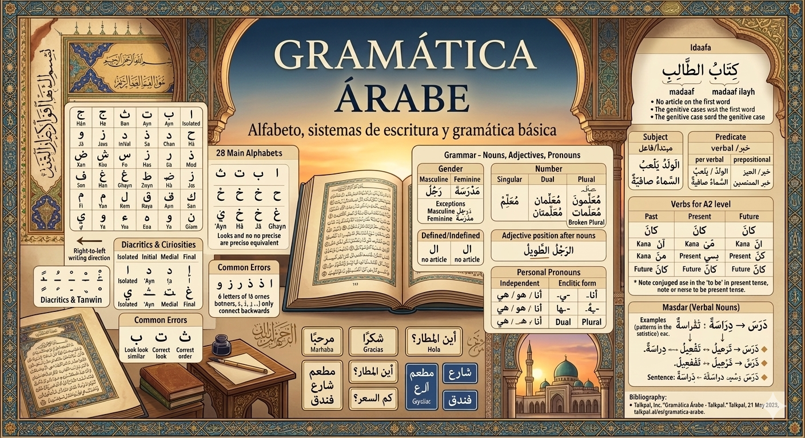
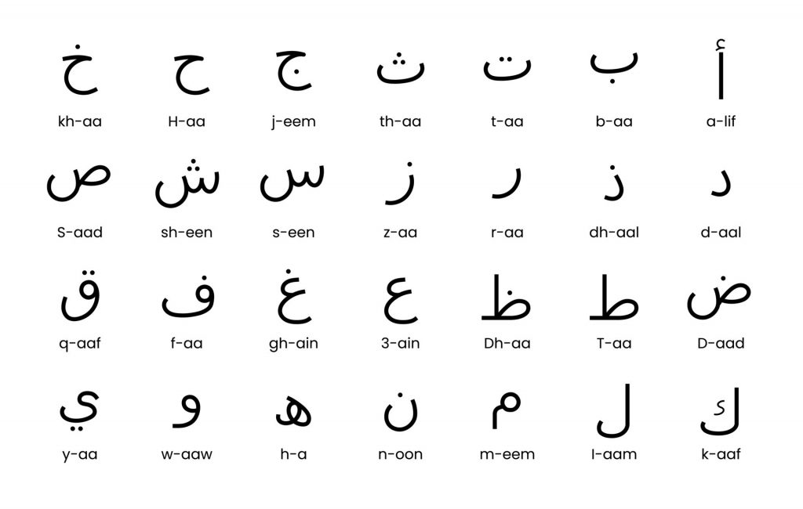
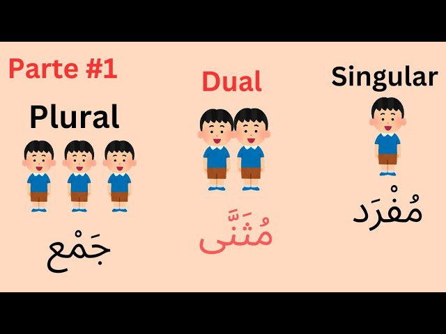
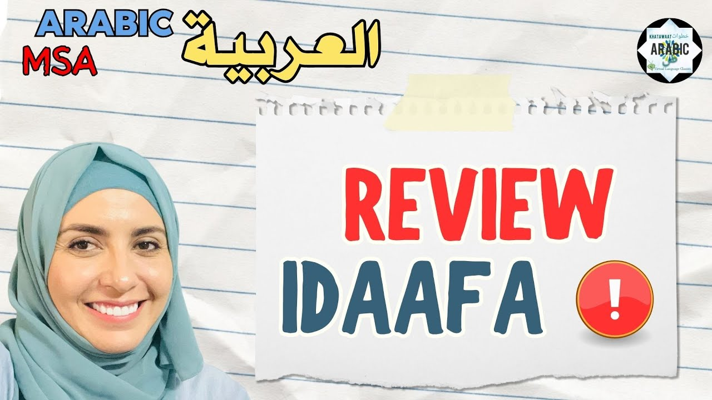
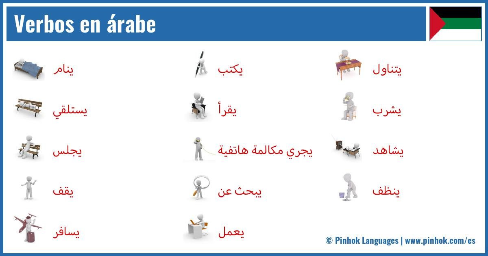

# Alfabeto árabe curiosidades

El alfabeto se redacta de derecha a izquierda y esto se refiere a cómo se forman letras, palabras y números (aunque a veces los números se presentan en formato occidental). Son 28 letras que son consonantes y las vocales breves son marcas diacríticas y no se consideran letras. Las letras pueden tener variaciones en su forma dependiendo de su ubicación en la palabra: al inicio, en el medio, al final o solas. No hay letras en mayúscula o minúscula. Algunas letras como ع (‘Ayn), ح (Ḥā), خ (Jā), غ (Ghayn) no tienen una traducción precisa al español.
Son esenciales para distinguir palabras que tienen diferentes significados. Ciertas letras no se conectan con la siguiente
Seis letras (ا, د, ذ, ر, ز, و) solo se unen a la letra anterior, sin conectarse a la siguiente. La ligadura más conocida es Lām-Alif (لا). El alfabeto árabe se emplea extensamente en el arte, la arquitectura y los manuscritos. La caligrafía árabe posee estilos como Naskh, Thuluth y Kufic. También se utiliza en persa, urdu, malayo y otros idiomas relacionados con el islam.

## Alfabeto

| Letra | Nombre | Letra | Nombre |
|-------|--------|-------|--------|
| ا     | Alif   | ط     | Ṭā     |
| ب     | Bā     | ظ     | Ẓā     |
| ت     | Tā     | ع     | ‘Ayn   |
| ث     | Thā    | غ     | Ghayn  |
| ج     | Jīm    | ف     | Fā     |
| ح     | Ḥā     | ق     | Qāf    |
| خ     | Jā     | ك     | Kāf    |
| د     | Dāl    | ل     | Lām    |
| ذ     | Dhāl   | م     | Mīm    |
| ر     | Rā     | ن     | Nūn    |
| ز     | Zāy    | ه     | Hā     |
| س     | Sīn    | و     | Wāw    |
| ش     | Shīn   | ي     | Yā     |
| ص     | Ṣād    |  ض    | Ḍād    |

## Posiciones clave de las letras del alfabeto

- **Forma Aislada:** La letra está separada, en su forma completa o básica.
- **Forma Inicial:** La letra que se coloca al inicio de la palabra; normalmente pierde su parte final o "cola" para unirse.
- **Forma Media:** Ubicada entre dos letras, se conecta por ambos lados.
- **Forma Final:** En la parte final de la palabra, a menudo vuelve a su forma básica al unirse a la letra anterior.
- Existen 6 caracteres (ا, د, ذ, ر, ز, و) que no se unen con la letra que viene después, por lo tanto, solo utilizan sus formas aisladas o finales, incluso si están en el centro de una palabra.

## Vocales y signos diacríticos

A pesar de que el alfabeto árabe no tiene vocales en sus letras fundamentales, emplea marcas diacríticas para indicar las vocales breves.

- Fatha ( َ ): indica una vocal corta «a».
- Damma ( ُ ): indica una vocal corta «u».
- Kasra ( ِ ): indica una vocal corta «i».
- Sukun ( ْ ): indica ausencia de vocal.
- Shadda ( ّ ): indica la duplicación de la consonante.

## Sonidos característicos

- Sonidos Enfáticos: Letras como ص (Saad), ض (Daad), ط (Taa), ظ (Dhaa) se articulan con la parte posterior de la lengua elevada hacia el techo de la boca, generando un sonido "grave" o resonante.
- Sonidos Guturales (Garganta): En árabe se emplean letras profundas como ع (Ain - intensa) y ح (Haa - profunda y aspirada).
- Hamza (ء): La obstrucción glotal, un corte brusco en la voz.
- Shadda ( ّ ): Símbolo que señala consonante geminada o doble (intensificación).
- Tanwin: Doble vocal al final de la palabra que crea un sonido consonántico adicional /n/ (un, in, an).

## Errores comunes

1. Confundir letras que se ven igual: Hay letras que lucen bastante similares, como ب (ba), ت (ta), y ث (tha).
2. No recordar las formas en contexto: No ejercitar las diferentes versiones de las letras según donde aparecen en la palabra.
3. Desatender la pronunciación adecuada: No observar los sonidos específicos y los signos diacríticos.
4. No entrenar la dirección de la escritura: Escribir de izquierda a derecha en lugar de derecha a izquierda.

## Ejemplos prácticos

Frases cortas útiles:

مرحبا (Marḥabā) → Hola

شكرا (Shukran) → Gracias

أين المطار؟ (Ayna al-maṭār?) → ¿Dónde está el aeropuerto?

كم السعر؟ (Kam as-siʿr?) → ¿Cuánto cuesta?

Lectura de carteles y menús:

- Restaurante: مطعم

- Calle: شارع

- Hotel: فندق

--- 

# La frase: sustantivos y determinantes

La noción de sustantivos dentro de la gramática árabe es un aspecto esencial que sostiene la estructura de las oraciones en este idioma. En árabe, los sustantivos se dividen en tres grupos principales: masculino, femenino y plural. Se le asigna un género y un número a cada sustantivo, lo que influye en la concordancia de otros elementos en la frase.

Los sustantivos masculinos frecuentemente finalizan en una vocal larga o en una consonante, mientras que los sustantivos femeninos generalmente concluyen con las letras "t" o "a". La forma plural en los sustantivos árabes se expresa agregando ciertas terminaciones o alterando el patrón de las vocales en el sustantivo.
Otro punto relevante en la teoría de los sustantivos es la idea de "definido" e "indefinido". En árabe, los sustantivos pueden ser definidos (cuando se refieren a algo específico o conocido) o indefinidos (cuando se refieren a algo más general o desconocido). Los sustantivos definidos se distinguen por la inclusión de artículos definidos como "al" o "al-" antes del sustantivo.

## Los sustantivos: género y número

Aunque también hay aspectos muy interesantes como los plurales rotos o sustantivos contables e incontables. En este apartado se hablarán de tres aspectos clave para los sustantivos

1. Concordancia: Los adjetivos, pronombres y acciones deben coincidir en género con el sustantivo al que se relacionan.
2. Claridad: Ayuda a identificar y distinguir los sujetos y objetos en la oración.
3. Corrección gramatical: Es esencial para formar oraciones que sean gramaticalmente correctas y prevenir confusiones.

## Género de los sustantivos

1. **Género masculino**
- Sustantivos que se refieren a hombres o seres masculinos (como رَجُل – hombre).
- La mayoría de los sustantivos que acaban en consonante o en vocal corta sin incluir la letra ة.
- Los nombres de días, meses y direcciones tienden a ser masculinos.

1. **Género femenino**
- Sustantivos que terminan en ة o ـة (ta marbuta), por ejemplo, مَدْرَسَة (escuela).
- Sustantivos que designan a mujeres o seres femeninos (مَرْأَة – mujer).
- Algunos sustantivos que terminan en اء o ى también pueden ser considerados femeninos, dependiendo de la situación.

1. **Excepciones y casos especiales**
- Sustantivos femeninos sin ta marbuta: Algunos nombres femeninos no finalizan en ة, como أُمّ (madre).
- Sustantivos masculinos que tienen una terminación femenina: Hay palabras masculinas que terminan en ة, como رَجُلَة (un término poco común que puede ser utilizado en ciertos dialectos).
- Sustantivos colectivos: Algunos pueden variar de género según su significado o contexto.

## Género en plural y en dual

- *Plural masculino:* generalmente se crea sumando ونَ o ينَ al término del sustantivo (مُعَلِّمون – docentes).
- *Plural femenino:* comúnmente se realiza con ات (مُعَلِّمات – docentes mujeres).
- *El dual:* la forma dual en árabe es una estructura gramatical que señala exactamente dos objetos, y cuenta con finales particulares para masculino y femenino:
*Masculino dual:* finaliza en انِ o ينِ (مُعَلِّمان – dos docentes).
*Femenino dual:* termina en تانِ o تينِ (مُعَلِّمتان – dos docentes mujeres).

## Adjetivos y pronombres personales 

Los adjetivos coinciden con el género, la cantidad y el caso del nombre que alteran, lo que convierte al árabe en un idioma singular y diverso en su forma de expresarse. Los pronombres se emplean para sustituir los nombres y aludir a ellos de un modo más breve.

## Posición de los adjetivos

Una de las normas fundamentales de la gramática árabe es que los adjetivos generalmente se sitúan después del sustantivo. 

1. Adjetivos detrás del sustantivo

En árabe, el adjetivo se posiciona justo después del sustantivo que describe, creando lo que se denomina una frase nominal o إضافة وصفية. Un ejemplo de esto sería:
الرجلُ الطَويلُ (ar-rajulu aṭ-ṭawīlu) – El hombre alto
المرأةُ الجميلةُ (al-mar’atu al-jamīlah) – La mujer hermosa
En estas situaciones, el adjetivo sigue al sustantivo y coincide en género y caso.

## Posición de los adjetivos 

2. Concordancia en género y cantidad: es necesario que el adjetivo coincida con el sustantivo en género

1. Masculino singular: الرجلُ طويلٌ
2. Femenino singular: المرأةُ طويلةٌ
3. Dual: الولدانِ طويلانِ (los dos niños son altos)
4. Plural masculino: الرجالُ الطوالُ
5. Plural femenino: النساءُ الطويلاتُ
Además, la concordancia en cantidad se adapta al sustantivo, haciendo que el adjetivo también cambie su forma.

## Posición de los adjetivos

3. Determinación y su efecto en la posición del adjetivo
- Cuando el sustantivo es determinado: Si el sustantivo es determinado (es decir, tiene el artículo definido ال o es un nombre propio), entonces el adjetivo también tiene que estar determinado. Por ejemplo:
الكتابُ الجديدُ (al-kitābu al-jadīdu) – El libro nuevo
المدرسةُ الكبيرةُ (al-madrasatu al-kabīrah) – La escuela grande
- Cuando el sustantivo es indeterminado: Si el sustantivo no es determinado (carece de artículo definido y lleva tanwīn), el adjetivo debe ser también indeterminado:
كتابٌ جديدٌ (kitābun jadīdun) – Un libro nuevo
مدرسةٌ كبيرةٌ (madrasatun kabīratun) – Una escuela grande

## Pronombres 

Se emplean para sustituir los nombres y aludir a ellos de un modo más breve. Dentro de toda la gama de pronombres existentes, vamos a hablar de los ***personales***.
**Los pronombres personales** son términos que sustituyen a los nombres o sustantivos con el fin de prevenir la repetición y mejorar la comunicación. En árabe, estos pronombres son fundamentales ya que muestran datos sobre el género (masculino o femenino), número (singular, dual o plural) y persona (primera, segunda o tercera).

## Pronombres personales eclíticos 

Estos pronombres se agregan al verbo, sustantivo o preposición y actúan como sufijos que muestran el objeto o la posesión. Son comunes en la estructura de los verbos y en la creación de frases que expresan posesión.

| Persona   | Singular                        | Dual                           | Plural                          |
|-----------|---------------------------------|--------------------------------|---------------------------------|
| Primera   | ـي / ـني (ī/ni) – mi, me        | ـنا (nā) – nuestro/a, nos      | ـنا (nā) – nuestro/a, nos       |
| Segunda   | ـكَ (ka) – tu, te (masc.)   ـكِ (ki) – tu, te (fem.) | ـكما (kumā) – vuestro/a, os (dual) | ـكم (kum) – vuestro/a, os (masc.)   ـكنَّ (kunna) – vuestro/a, os (fem.) |
| Tercera   | ـهُ (hu) – su, lo (masc.)   ـها (hā) – su, la (fem.) | ـهما (humā) – su, los/las (dual) | ـهم (hum) – su, los (masc.)   ـهنَّ (hunna) – su, las (fem.) |

## Pronombres personales independientes

Estos pronombres actúan como sujetos que no dependen de otros en la frase. Son términos por sí solos y se utilizan para resaltar o para señalar de manera clara al sujeto.

| Persona   | Singular                           | Dual                              | Plural                             |
|-----------|-----------------------------------|----------------------------------|-----------------------------------|
| Primera   | أنا (ana) – yo                     | نحن (naḥnu) – nosotros/as (dual y plural) | نحن (naḥnu) – nosotros/as         |
| Segunda   | أنتَ (anta) – tú (masc.)   أنتِ (anti) – tú (fem.) | أنتما (antumā) – vosotros/as (dual) | أنتم (antum) – vosotros (masc.)   أنتنَّ (antunna) – vosotras (fem.) |
| Tercera   | هو (huwa) – él   هي (hiya) – ella | هما (humā) – ellos/ellas (dual)  | هم (hum) – ellos (masc.)   هنَّ (hunna) – ellas (fem.) |

---

# Estructura y relaciones
 
En la gramática del árabe, una de las características más notables y diferenciadoras es la teoría de la Idaafa (construcción de posesión). La Idaafa es un tipo de estructura gramatical que une dos o más sustantivos para establecer una relación de posesión entre ellos. Se crea colocando el marcador genitivo «ي» (que se pronuncia «ya») entre los sustantivos.

El primer sustantivo en la Idaafa se denomina mudaf (el que se posee), mientras que el segundo se conoce como mudaf ilayh (el que posee). La Idaafa se utiliza para indicar propiedad, atribución o conexión entre los dos sustantivos. Puede emplearse para demostrar diversas relaciones, incluyendo posesión, descripción, ubicación y tiempo.

## Idaafa (construcción genitiva)

Características fundamentales de la construcción Idaafa:

- Estructura: Normalmente, se compone de dos sustantivos que están uno al lado del otro. El primero (المضاف – al-muḍāf) es el sustantivo que se posee o se especifica, y el segundo (المضاف إليه – al-muḍāf ilayh) es el sustantivo que hace la posesión o especificación.
- El primer sustantivo no lleva artículo definido: En una estructura posesiva, el primer sustantivo no se coloca delante del artículo definido ال (al-), aunque tenga un sentido definido. Por ejemplo, se dice كتابُ الأستاذِ (“el libro del profesor”) y no se dice الكتابُ الأستاذِ.
- El segundo sustantivo puede ser definido o indefinido: Si el segundo sustantivo es definido, toda la expresión se considera definida. Si es indefinido, la interpretación es indefinida.
- Casos gramaticales: El primer sustantivo puede estar en caso nominativo, acusativo o genitivo según su función en la oración, mientras que el segundo sustantivo se encuentra siempre en caso genitivo (caso de ‘yad’).
- No se permiten adjetivos entre los dos sustantivos: Los adjetivos siempre se colocan después de toda la estructura.
  
## Ejemplos

1. كتابُ الطالبِ (Kitābu al-ṭālibi) – “El libro del estudiante”. Aquí, كتابُ es el sustantivo poseído y الطالبِ el poseedor. El segundo sustantivo está en genitivo.
2. بابُ المدرسةِ (Bābu al-madrasati) – “La puerta de la escuela”.

## Reglas importantes

1. Estado definido e indefinido
El sentido y la definición de una construcción dependen del segundo sustantivo:
Si el segundo sustantivo es definido: La construcción total será definida. Ejemplo: كتابُ الطالبِ (“el libro del estudiante”).
Si el segundo sustantivo es indefinido: La construcción será indefinida. Ejemplo: كتابُ طالبٍ (“un libro de un estudiante”).
2. Casos gramaticales de la Idaafa
En árabe, los nombres cambian su final según el caso gramatical (nominativo, acusativo, genitivo). En la Idaafa:
El primer sustantivo (al-muḍāf) conserva su caso según la función que tiene en la oración.
El segundo sustantivo (al-muḍāf ilayh) siempre está en genitivo, señalado por la vocal final adecuada (kasra o sukun si es un nombre propio).
3. Adjetivos y la Idaafa
Los adjetivos que caracterizan al primer sustantivo no pueden interrumpir la construcción genitiva. Deben ir después de toda la estructura. Ejemplo:
كتابُ الطالبِ الجديدُ – “El libro nuevo del estudiante”, no *كتابُ الجديدِ الطالبِ.

## Preposiciones

| Preposición Árabe | Transcripción | Significado en Español           | Ejemplo                | Traducción                  |
|------------------|---------------|---------------------------------|-----------------------|-----------------------------|
| في               | fī            | en, dentro de                   | الكتاب في الحقيبة      | El libro está en la bolsa   |
| على              | ʿalā          | sobre, encima de                | الكتاب على الطاولة     | El libro está sobre la mesa |
| من               | min           | de, desde                        | هو من مصر              | Él es de Egipto             |
| إلى              | ilā           | a, hacia                         | ذهبت إلى المدرسة       | Fui a la escuela            |
| عن               | ʿan           | sobre, acerca de, desde          | تحدثت عن الكتاب       | Hablé sobre el libro        |
| بِـ               | bi-           | con, por medio de               | كتبت بالقلم            | Escribí con la pluma        |
| كـ               | ka-           | como                             | هو كالأسد             | Él es como un león          |
| لِـ               | li-           | para, a, debido a               | هذا الكتاب لي         | Este libro es para mí       |

## Sujeto

El sujeto actúa como el centro de una oración, ya sea nominal o verbal, que efectúa una acción o sobre quien se expresa una condición mediante el verbo o la parte correspondiente. La palabra árabe para "sujeto" es الفاعل (al-fā‘il) en el caso de oraciones verbales, y المبتدأ (al-mubtada’) en oraciones nominales.

Características del Sujeto en Árabe
- Concordancia: Es necesario que el sujeto coincida con el verbo en lo que respecta a persona, número y género.
- Posición: En las oraciones nominales (الجملة الاسمية), normalmente, el sujeto se encuentra al principio actuando como el مبتدأ (mubtada’).
- Casos gramaticales: Usualmente, el sujeto se encuentra en caso nominativo (مرفوع), el cual se marca con signos diacríticos como الضمة (ḍamma).
- Tipos de sujeto: El sujeto puede ser un sustantivo, un pronombre, o incluso una oración subordinada.
- Ejemplos de Sujeto en Árabe
الولدُ يلعبُ. (Al-waladu yal‘abu) – El niño se encuentra jugando. (الولدُ es el sujeto)
السماءُ صافيةٌ. (As-samā’u ṣāfiyatun) – El cielo se halla despejado. (السماءُ es el sujeto)

## Predicado

El predicado en lengua árabe es la sección de la oración que indica lo que se afirma sobre el sujeto. En árabe, se llama الخبر (al-khabar) en las oraciones nominales y puede manifestarse de diferentes maneras en las oraciones verbales.

Tipos de Predicado en Árabe

- Predicado Verbal (الجملة الفعلية): Esta forma incluye el verbo y sus complementos, como en كتبَ الطالبُ الدرسَ (El estudiante escribió la lección).
- Predicado Nominal (الخبر): En las oraciones nominales, el predicado puede ser:
1. خبر مفرد (Khabar mufrad): Un único sustantivo o adjetivo. Por ejemplo: السماءُ صافيةٌ.
2. خبر جملة (Khabar jumla): Una oración completa que funciona como predicado. Por ejemplo: الولدُ يلعبُ في الحديقةِ.
3. خبر شبه جملة (Khabar shibh jumla): Una construcción preposicional o adverbial que actúa como predicado. Por ejemplo: الولدُ في الحديقةِ.

---

# Verbos nivel a2

De todo lo que nos podemos imaginar y encontrar en este apartado, para un nivel a2, hay dos aspectos fundamentales que hay que abordar: 

1. **Kana (ser/ estar):** Kana (كان) es un verbo que se usa como copula, y se traduce comúnmente como "ser" o "estar". No obstante, su aplicación en árabe no es tan simple como en español. Kana se emplea para indicar estados o condiciones que ocurrieron en el pasado, además de servir para introducir tiempos compuestos y comunicar situaciones que son continuas o que se repiten.
2. Los nombres que provienen de verbos, conocidos como sustantivos verbales o másdar, son formas de sustantivos que surgen de los verbos. Estos sustantivos reflejan la acción o el proceso relacionado con el verbo, pero se presentan en forma de nombre.

## Conjugación de Kana en pasado

| Pronombre        | Conjugación de Kana | Traducción                    |
|-----------------|------------------|-------------------------------|
| أنا (yo)         | كنتُ (kuntu)      | Yo fui/estuve                 |
| أنتَ (tú masc.)  | كنتَ (kunta)      | Tú fuiste/estuviste           |
| أنتِ (tú fem.)   | كنتِ (kunti)      | Tú fuiste/estuviste           |
| هو (él)          | كانَ (kāna)       | Él fue/estuvo                 |
| هي (ella)        | كانتْ (kānat)     | Ella fue/estuvo               |
| نحن (nosotros)   | كنا (kunnā)       | Nosotros fuimos/estuvimos     |
| أنتم (vosotros)  | كنتم (kuntum)     | Vosotros fuisteis/estuvisteis |
| هم (ellos)       | كانوا (kānū)      | Ellos fueron/estuvieron       |

## Conjugación de Kana en presente 

| Pronombre        | Conjugación de Kana | Traducción            |
|-----------------|------------------|---------------------|
| أنا (yo)         | أكونُ (akūnu)     | Yo soy/estoy        |
| أنتَ (tú masc.)  | تكونُ (takūnu)    | Tú eres/estás       |
| أنتِ (tú fem.)   | تكونينَ (takūnīna)| Tú eres/estás       |
| هو (él)          | يكونُ (yakūnu)    | Él es/está          |
| هي (ella)        | تكونُ (takūnu)    | Ella es/está        |
| نحن (nosotros)   | نكونُ (nakūnu)    | Nosotros somos/estamos |
| أنتم (vosotros)  | تكونونَ (takūnūna)| Vosotros sois/estáis |
| هم (ellos)       | يكونونَ (yakūnūna)| Ellos son/están      |

## Conjugación de Kana en el futuro 

El futuro en árabe se forma añadiendo la partícula سـ o سوف antes del verbo en presente. Por ejemplo:

- سَأكونُ (sa’akūnu) – Yo seré/estaré
- سَيكونُ (sayakūnu) – Él será/estará

## Diferencias entre español y árabe

En español, el verbo «ser» actúa como un verbo que conecta el sujeto con una característica o una identidad, y se usa en todos los tiempos. En árabe, el verbo Kana no se emplea en presente en oraciones afirmativas que no tienen verbo, lo cual hace que se omita. Por ejemplo:
- Él es profesor. → هو أستاذ. (Huwwa ustaadh. ) Sin un verbo claro.
- Él fue profesor. → كان أستاذاً. (Kāna ustaadhan. ) Incluye el verbo Kana.

## Tipos de suntantivos verbales

1. Masdar Simples: estos son nombres de acción que provienen directamente de la raíz de tres letras del verbo, sin adiciones ni alteraciones complicadas. Representan la forma más sencilla y habitual de los nombres de acción.
- Ejemplo: دَرَسَ (darasa) – estudiar → دِرَاسَة (dirāsah) – estudio
- Ejemplo: فَعَلَ (faʿala) – hacer → فِعْل (fiʿl) – acción
2. Masdar Derivados o Compuestos: estos nombres de acción se crean a partir de verbos que siguen patrones más complejos o mediante la inclusión de prefijos y sufijos o al combinar raíces. Frecuentemente, estos masdars poseen significados más concretos o sutiles.
- Ejemplo: اِسْتَفْعَلَ (istafʿala) → اِسْتِفْعَال (istifʿāl) – solicitud o petición
- Ejemplo: تَكَلَّمَ (takallama) → تَكَلُّم (takallum) – habla, conversación

## Patrones para la formación 

- Forma I (فعل – faʿala): Masdar típico en el patrón فِعَالَة (fiʿālah) o فَعْل (faʿl), por ejemplo, كِتَابَة (kitābah) de كَتَبَ (kataba).
- Forma II (فعّل – faʿʿala): Masdar en patrón تَفْعِيل (tafʿīl), por ejemplo, تَدْرِيس (tadrīs) de دَرَّسَ (darrasa).
- Forma X (استفعل – istafaʿala): Masdar en patrón اِسْتِفْعَال (istifʿāl), como اِسْتِخْدَام (istikhdām) de اِسْتَخْدَمَ (istakhdama).

## Ejemplo de su uso

- Sujeto: الدراسة مهمة (Ad-dirāsah muhimmah) – «El estudio es importante».
- Objeto: أحب القراءة (Uḥibbu al-qirā’ah) – «Me gusta la lectura».
- Complemento con preposición: ذهبت إلى التسوق (Dhahabtu ilā at-tasawwuq) – «Fui de compras».

---

# Bibliografía

Talkpal, Inc. “Gramática Árabe - Talkpal.” Talkpal, 21 May 2025, talkpal.ai/es/gramatica-arabe.

[Enlace al ejercicio](https://github.com/albaromogutierrez/repositorio-arabe/04-sistema-escritura-pronunciación-arabe-A1/situaciones-practicas/index.html ':target=_blank')